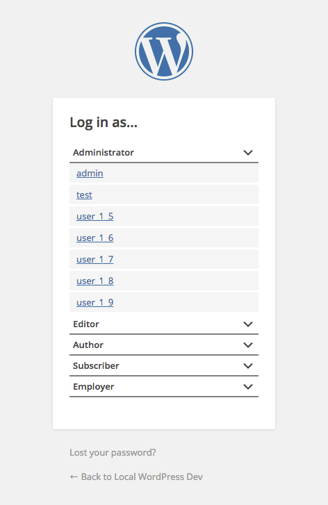

# Log In As

## NOT FOR USE IN PRODUCTION ENVIRONMENTS

Log in as any user. Handy for local dev where databases come and go and you can never remember the dang credentials.

Includes user-switching for logged-in users too.
